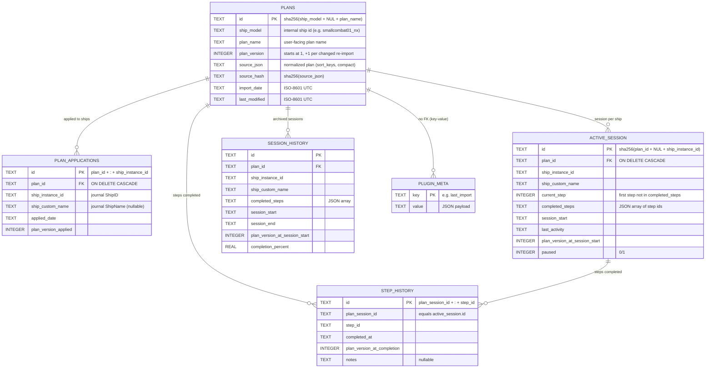
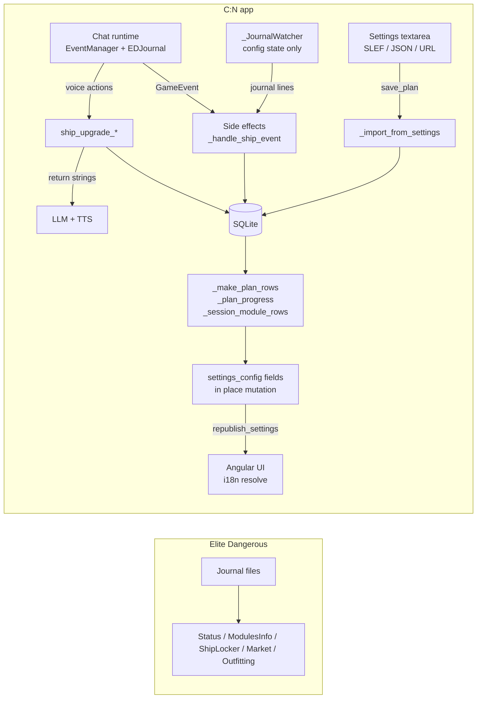

# Ship Upgrade Manager — Data Structure Reference

This document describes every data structure owned or consumed by the
**Ship Upgrade Manager** plugin (`plugins/ship_upgrade_manager/`): the
SQLite persistence layer, in-memory state, the UI settings contract, the
progress model, and the runtime projection exposed to the AI.

Producer methods are named throughout so each structure can be traced back
to the code that builds it.

---

## 1. Overview — four data layers

| Layer | Location | Lifetime | Produced by |
| :--- | :--- | :--- | :--- |
| SQLite database | `plugin_data/<guid>/ship_upgrade_manager.db` | Persistent (survives app restarts and plugin updates) | `_initialize_database`, `import_plan`, `start_session`, `complete_step`, … |
| In-memory instance state | plugin instance attributes | App session only | `__init__`, `_handle_ship_event`, `_import_from_settings` |
| Persisted settings | `config.json → plugin_settings[guid]` | Persistent (user-facing) | UI edits, `update_plugin_setting` |
| Derived UI data | `settings_config` field objects | Rebuilt on demand | `_make_plan_rows`, `_plan_progress`, `_session_module_rows`, `_progress_metrics` |

The UI never reads the database directly: every row, paragraph and progress
block it displays is a *derived* structure rebuilt by `_publish_status()`
and pushed with `PluginManager.republish_settings()`.

---

## 2. SQLite schema

Created by `_initialize_database()` (`CREATE TABLE IF NOT EXISTS …`,
plus a legacy migration). Connection access is centralized in
`get_db()` — one short-lived `sqlite3` connection per operation, with
`PRAGMA foreign_keys = ON`.

### Entity-relationship overview



### `plans` — one row per imported plan

| Column | Type | Role |
| :--- | :--- | :--- |
| `id` | TEXT PK | Stable across versions; `sha256(ship_model + "\\0" + plan_name)`. |
| `ship_model` | TEXT NOT NULL | Internal ship id — e.g. `smallcombat01_nx`, `python`. Plans of different ships never collide. |
| `plan_name` | TEXT NOT NULL | Unique **per ship** (`UNIQUE(ship_model, plan_name)`). |
| `plan_version` | INTEGER, default 1 | Incremented only when `source_hash` changes (`import_plan`). |
| `source_json` | TEXT | The normalized plan as stored by `json.dumps(source, sort_keys=True, separators=(",", ":"))`. Steps are re-parsed lazily with `_plan_steps(source_json)`. |
| `source_hash` | TEXT | Used to skip no-op re-imports. |
| `import_date` / `last_modified` | TEXT | ISO-8601 UTC. |

### `active_session` — one row per (plan, ship) pair

The stable id is `sha256(plan_id + "\\0" + ship_instance_id)` — starting a
session for the same plan on the same ship **archives** the previous one
into `session_history` and resets this row.

| Column | Type | Role |
| :--- | :--- | :--- |
| `id` | TEXT PK | Hash above. |
| `plan_id` | TEXT FK → plans | Cascade delete with the plan. |
| `ship_instance_id` | TEXT NOT NULL | Journal `ShipID` (numeric id as string). |
| `ship_custom_name` | TEXT | Journal `ShipName` (nullable). |
| `current_step` | INTEGER | Index of the first step not in `completed_steps`. |
| `completed_steps` | TEXT | JSON array of step ids, e.g. `["module_0","module_3"]`. Seeded by loadout baseline at session start. |
| `paused` | INTEGER | 0/1 — pauses event-driven completion. |

### `step_history` — completion ledger

One row per completed step per session, `UNIQUE(plan_session_id, step_id)`.
Written by `complete_step` (journal events and voice actions), pruned by
plan migrations (`_migrate_active_session` deletes rows whose steps were
dropped or changed).

### `session_history` — archive

Written by `_archive_active_session` when a session is stopped or replaced
(`start_session` on an existing id, `stop_session`). Carries
`session_start`/`session_end` and `completion_percent` for past runs.

### `plugin_meta` — plugin key-value store

`key TEXT PK, value TEXT (JSON)`. Currently holds a single key:

```json
{
  "plan_id": "00d4668a…",
  "plan_name": "Imported Kestrel Mk II",
  "ship_model": "smallcombat01_nx",
  "version": 2,
  "modules": 26,
  "sessions": 1
}
```

Producer: `_save_last_import` / `_load_last_import` / `_clear_last_import`.
Used to restore the "imported" tunnel state at app startup
(`_reload_state_from_database`).

### Indexes

- `idx_plan_applications_ship ON plan_applications(ship_instance_id)`
- Implicit: PK lookups on every table; FK cascade indexes on delete.

---

## 3. Identity rules and migrations

| Entity | Identity | Consequence |
| :--- | :--- | :--- |
| Plan | `sha256(ship_model \0 plan_name)` | Renaming keeps the id (`rename_plan`); re-importing a same-named plan for another ship creates a different plan. |
| Session | `sha256(plan_id \0 ship_instance_id)` | One active session per (plan, ship); replacing archives the old one. |
| Step | `module_<index>` | Generated by the parser; **not stable across re-imports** — completion is migrated by matching `id` + step signature, not by index. |

**Legacy migration** (`_initialize_database`): databases created before the
multi-session support had `active_session` with `CHECK (ID = 'ACTIVE')`.
Those tables are rebuilt in place (`active_session_v2` → rename) preserving
rows, and `paused` is added if missing. New tables are created with
`CREATE TABLE IF NOT EXISTS`, so adding `plugin_meta` required no migration.

---

## 4. In-memory state (instance attributes)

| Attribute | Type | Lifetime | Producer / consumer |
| :--- | :--- | :--- | :--- |
| `_import_state` | `str` ∈ `idle` \| `data` \| `imported` | Until app restart (re-derived from `plugin_meta` in `on_chat_start`) | `_enter_import_state`, `_build_grids` |
| `_current_ship_id` | `str` | App session; re-detected from journals in config state | `_handle_ship_event`, `_detect_ship_from_journal`, `_start_plan_session_from_settings` |
| `_current_ship_name` | `str` | App session | `_handle_ship_event` (journal `ShipName`), session start |
| `_current_loadout_modules` | `list[dict]` | App session; refreshed by `Loadout`/`ModuleInfo` events | `_handle_ship_event`, consumed by `_loadout_for_ship` |
| `_last_import` | `dict \| None` | Mirrors `plugin_meta["last_import"]` | `_confirm…`/`_import_from_settings`, `_delete_plan_by_id`, `rename_plan` |
| `_last_plan_filter` | `str` | Change-detector for the live filter | `_make_plan_rows`, `on_settings_changed` |
| `_watch_active` | `bool` | `True` in config state (journal watcher processes entries), `False` while the runtime runs | `on_chat_start` / `on_chat_stop` |

The **import tunnel** has no persisted state beyond `plugin_meta`: an
in-progress import (`data` state) is lost at restart, while the last
completed import (`imported` state) is restored from `plugin_meta`.

---

## 5. Normalized plan steps

Produced by `parsers.parse_plan_input` → `_normalize_steps` and re-parsed
from `plans.source_json` with `_plan_steps`. One step per module:

```json
{
  "id": "module_0",
  "type": "module",
  "label": "Install Int_Powerplant_Size5_Class5 in PowerPlant",
  "item": "Int_Powerplant_Size5_Class5",
  "slot": "PowerPlant",
  "engineering": {
    "BlueprintName": "PowerPlant_Armoured",
    "Level": 5,
    "Quality": 1,
    "ExperimentalEffect": "special_powerplant_cooled",
    "Modifiers": [ {"Label": "Mass", "Value": 12, "OriginalValue": 10, "LessIsGood": 1} ]
  }
}
```

Rules:

- `item` is the SLEF/Journal symbolic id, matched **case-insensitively**
  after `_normalize_module_id` (strips leading `$`, trailing `_name;`,
  lowercases).
- `engineering` is the SLEF `Engineering` dict passed through verbatim
  (journal-style keys `BlueprintName`/`Level` or Coriolis-style
  `blueprint`/`level` — both accepted), or `None` for stock modules.
- Variant suffixes (`_fast`, `_strong`, `_overcharge`, `_agile`) and the
  `MkII…` ship-specific prefixes are part of the item id and identify
  **module generations**, not engineering blueprints.
- `id` values are positional (`module_<index>`) — completion migration
  matches on `id` **and** step signature (`_step_signature`), so re-imported
  plans with reordered steps keep their progress only where content is
  unchanged.

---

## 6. Settings and UI contract

### Persisted settings keys (`plugin_settings[guid]`)

| Key | Type | Role |
| :--- | :--- | :--- |
| `plan_input` | text (textarea) | The paste buffer of the import tunnel (data state). |
| `plan_filter` | text (filter) | Live search over plan name / ship model / public ship name. |
| `session_summary`, `delete_status`, `import_status`, `import_error`, `diff_preview` | paragraph contents | Mirror values — also kept in `self.settings[key]` so the manager refresh stays consistent. |

### Grids built by `_build_grids` / `_build_settings_config`

| Grid key | Visible | Fields |
| :--- | :--- | :--- |
| `import` | only when `_import_state != idle` | State `data`: `plan_input` (textarea), `save_plan` + `cancel_import` buttons. State `imported`: `import_done` banner + `new_import` button. |
| `plans` | always | `plan_filter` (filter), `available_plans` (list), `plans_status` (paragraph), `header_action` = `import_plan` (hidden while the tunnel is open). |
| `session` | always | `session_summary` (paragraph), `session_modules` (list). |

### `ListRow` contract (list fields)

```json
{
  "key": "module_2",
  "title": "Hyperdrive Overcharge",
  "title_key": "module.hyperdriveovercharge",
  "grade": "4A",
  "meta": "plugin.sum.sessionStep.targetProgress",
  "params": {"blueprint": "Long Range", "target": 5, "current": 2},
  "group": "plugin.sum.category.coreInternal",
  "pending": true,
  "progress": [ { … ListRowProgress … } ],
  "row_actions": [ {"action": "delete_plan", "icon": "delete",
                    "label": "plugin.sum.btn.delete", "danger": true,
                    "inline_edit": false} ]
}
```

- `title` is the **English fallback**; `title_key` (`module.<family>`) is
  resolved by the UI against the `module` namespace of
  `i18n-translations.ts` (EN/FR), falling back to `title` for unknown
  families.
- `grade` is the E:D letter notation of the module's size/class
  (1=E, 2=D, 3=C, 4=B, 5=A; size 0 → letter only; appended as `4A`).
- `meta` is an **i18n key** resolved with `params` — states:
  `absent`, `installed`, `targetAbsent`, `targetDone`, `targetProgress`
  (`current`/`target`), `targetOther` (different blueprint),
  `targetNotEngineered`.
- `pending` drives the orange highlight (row and, aggregated, its group
  header).
- `group` is a category i18n key (`coreInternal`, `optionalInternal`,
  `hardpoints`, `utilityMounts`) from `_module_category`; the UI collapses
  groups and shows counts (unit: `plan` or `module`).
- Row actions are routed to `on_settings_button` as
  `<action>:<rowKey>` with an optional `value` (inline title edit →
  `rename_plan`). Producers: `_make_plan_rows` (plans list),
  `_session_module_rows` (session detail).

### `ListRowProgress` (embedded under plan rows)

```json
{
  "ship": "Mina",
  "ship_model": "Kestrel Mk II",
  "paused": false,
  "modules_done": 18,
  "modules_total": 26,
  "modules_pct": 69,
  "eng_current": 15,
  "eng_target": 94,
  "eng_pct": 16,
  "next_label": "Shield Generator",
  "next_key": "module.shieldgenerator",
  "next_class": "5C",
  "next_grade": 5,
  "next_engineering": "Thermic"
}
```

- `ship` = custom name when set, else the **public** ship model name
  (`ship_names.json`).
- `modules_*` / `eng_*`: the two-criteria model (§7), computed from the
  ship's **current loadout**, not from completed steps.
- `next_*`: first step not in `completed_steps` (event-driven order);
  `next_label`/`next_key`/`next_class` identify the module,
  `next_grade`/`next_engineering` its engineering target.
- Absent when no active session exists for the plan.

---

## 7. Progress metrics

Produced by `_progress_metrics(steps, loadout_modules)` (per-session) via
`_match_steps` (greedy one-to-one matching, slot preferred when known).

**Criterion 1 — modules installed**

```text
modules_done = |{ steps whose item matches an unused loadout module }|
modules_pct  = round(modules_done / modules_total × 100)
```

**Criterion 2 — engineering levels (strict)**

```text
eng_target  = Σ required Level over every plan step that requires engineering
              (whether or not the module is installed)
eng_current = Σ min(journal Level, required Level) per step where
              the loadout module's BlueprintName family matches the target
              (family = last `_`-segment, case-insensitive; a different
              blueprint scores 0; a module without engineering scores 0)
eng_pct     = round(eng_current / eng_target × 100)   — omitted if target = 0
```

Example (Kestrel Mk II, real journal state vs SLEF target): 25/26 modules
installed; engineering 15/94 → **16 %** — the honest remaining-work view.

The loadout source is `_loadout_for_ship(ship_instance_id)`: the live
runtime snapshot (`_current_loadout_modules`, updated by `Loadout` /
`ModuleInfo` events) or, in config state, the newest matching `Loadout`
read directly from the journals (`_loadout_baseline_for_ship`).

**Baseline at session start** (`start_session`): steps already satisfied by
the current loadout — installed module, and matching engineering when the
plan requires it — are seeded into `completed_steps` so the *suggested
order* skips them. The bars, however, always reflect the live loadout.

---

## 8. Journal data consumed

Registered in `_on_event` → `helper.register_sideeffect`; identical
handling from the config-state `_JournalWatcher` thread via
`_handle_ship_event(content)`.

| Event | Fields consumed | Effect |
| :--- | :--- | :--- |
| `Loadout` | `ShipID`, `ShipName`, `Modules[]` (`Item`, `Slot`, `Engineering`) | Updates current ship/loadout snapshot; auto-completes matching steps; refreshes bars. |
| `ModuleInfo` | same as Loadout | Same (periodic full-loadout snapshot). |
| `ModuleBuy` / `ModuleSell` | `ShipID`, `FromItem`, `ToItem` | Auto-completion candidates. |
| `ModuleSwap` | `FromItem`, `ToItem` | Auto-completion candidates. |
| `ModuleStore` / `ModuleRetrieve` | `FromItem`, `ToItem` | Auto-completion candidates. |

Normalization rules (`_normalize_module_id`): lowercase; strip leading `$`
and trailing `_name;` (localized journal ids like
`$hpt_beamlaser_gimbal_large_name;`); `ToItem: "Null"` treated as *no
module*. Ship identity may arrive as `ShipID`, `ShipIdent`, `ShipName` or
`Ship` depending on the event. Events without a ship id are skipped when
sessions span multiple ships (ambiguity guard, logged).

---

## 9. Runtime projection and AI actions

### Projection (`ShipUpgradeProjection`, exposed to the LLM context)

```python
class ShipUpgradeState(BaseModel):
    plan_id: str | None
    plan_name: str | None
    ship_model: str | None
    ship_instance_id: str | None
    ship_custom_name: str | None
    current_step: int
    completed_steps: list[str]
    total_steps: int
    paused: bool
```

Registered in `on_chat_start` via
`helper.register_projection(ShipUpgradeProjection())`; fed by
`ProjectedEvent`s emitted by `_process_ship_event`-adjacent logic.

### Status generator (prompt context)

`_status_generator(projected_states)` returns
`[("Ship upgrade", "…{plan} on {ship}: {done}/{total} complete; next: {label}…")]`
— injected into the system prompt so the AI always knows the session state.

### Voice actions (LLM function calling)

| Action name | Parameters (pydantic) | Returns |
| :--- | :--- | :--- |
| `ship_upgrade_start_session` | `plan_name`, `ship_instance_id`, `ship_custom_name=""` | Confirmation + step count. |
| `ship_upgrade_complete_step` | `step_id`, `notes=""`, `session_id?` | Progress line. |
| `ship_upgrade_pause_session` / `resume_session` / `stop_session` | `session_id?` (+ context) | Status line. |
| `ship_upgrade_next_step` | `session_id?` (+ context) | Spec name + grade + engineering target ("…then engineer it with Thermic grade 5"). |
| `ship_upgrade_list_plans` | — | Plan inventory line. |
| `ship_upgrade_preview_changes` | `plan_input` | Diff summary text (plan vs stored plan). |
| `ship_upgrade_apply_changes` | `plan_input` | Applies the plan (voice equivalent of the import). |

All return plain strings consumed by the LLM (spoken via TTS).

---

## 10. Data flow



| Flow | Path |
| :--- | :--- |
| Game → plugin (runtime) | Journal → `EDJournal` thread → `EventManager` → `register_sideeffect` (`_on_event`) → `_handle_ship_event` → DB + bars. |
| Game → plugin (config state) | Journal → `_JournalWatcher` (1 s tail, entries dropped while the runtime runs) → `_handle_ship_event`. |
| Import | Textarea → `save_plan` → `parse_plan_input` → `import_plan` → `plans` + `plugin_meta["last_import"]` → imported state. |
| UI refresh | Field mutations in place (shared `settings_config` reference) → `PluginManager.republish_settings()` (broadcast-only, thread-safe) or `update_plugin_setting` (persists + hook). |
| Voice | LLM tool call → pydantic params → public method → DB → `_publish_status` → UI. |

---

*Reference implementation: `plugins/ship_upgrade_manager/` — all producer
methods cited above live in `ship_upgrade_manager.py` unless noted
otherwise. Testing baseline: 155 global tests + 51 plugin tests (see
`AGENT.md`).*
